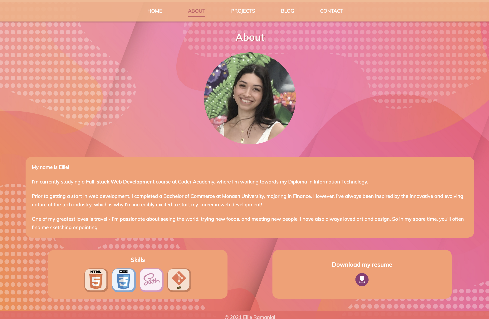

# PORTFOLIO WEBSITE

**Live Website:**

**GitHub Repo:**
<https://github.com/EllieRamanlal/portfolio>

___
### Purpose

The purpose of this portfolio website is to showcase my skills as a web developer, which will be demonstrated through the functionality of the website, and through examples of personal projects which will be featured on the website.

This portfolio website is also designed to provide viewers with an opportunity to learn more about my study/work background, interests, and experience so far as a web developer.  
___
### Functionality/features

**Navigation**

Ease of movement between main pages was a high priority whilst designing the layout of this website. For tablets and desktops, a navigation bar at the top of each webpage has been utilised in order to allow the user to navigate between the main pages of the website. For mobiles devices, a hamburger menu is featured instead, which allows users to access a dropdown menu by clicking on the hamburger icon.

The page that the user is currently on will be highlighted on the navigation menu in order to improve navigation through the site. For tablets and desktops, the current page will be a darker text colour and underlined on the top navigation bar. For mobiles, the current page will be highlighted a brighter colour on the dropdown menu.

**Homepage**

The home page is a simple webpage introducing myself as a web developer. There is also button directly below the main text, which prompts the user to move to the next page on the website. 

**About page**

The About page provides a brief background on myself, allowing the user to learn more about me as a person and as a web developer. This page also features a section which utilises icons to visually display my tech skill set. In the resume section of this page, there is also a download icon, which when clicked, allows the user the download a pdf copy of my resume. This icon is also animated on hover.

**Projects page**

The projects page is designed to showcase examples of my work as a web developer. Each project features an image of the work, the project title, and a brief description. To access the project, the user can click on the image or the title in order to be directed to the project’s GitHub repository. However, whilst I’m still developing the projects, only placeholders will be featured on my projects page. 

**Blog page**

This page features a list of blog posts, with an image, title, date and short snippet of text being displayed for each. For mobile devices, these blogs will be featured in a list consisting of one column. For larger devices, such as tablets and desktops, these blogs will be displayed in two columns, to better utilise screen space. 

To access each full blog post in the list, the user can either click on the blog title, or the button at the end of the text snippet which prompts the user to ‘read more’. When clicking on either of these links, the user will be taken to a new page which displays the full blog post. At the bottom of this page, there will be buttons which allow the user to move to the next/previous blog post, or to go back to the main blog list. 

**Contact page**

The contact page will feature links to my LinkedIn and GitHub accounts. To make this section more interactive for the user, animations have been applied to the LinkedIn and GitHub icons when hovering.

The contact page also features a form which allows to user to get in touch with me by submitting a message (this form has been implemented using Formspree). 

___
### Sitemap

___
### Screenshots

#### Mobile View

#### Tablet View

#### Desktop View

### Trello Board

<https://trello.com/b/OoqjUJV6/portfolio>

13/04/21

14/04/21

15/04/21

16/04/21

17/04/21

18/04/21

19/04/21

21/04/21

___
### Target Audience

The target audience of this website audience is currently my peers and educators, as this is a course project which will be assessed. However, as I continue to develop this portfolio, the target audience will eventually be potential employers. 
___
### Tech stack

This site was created with the use of HTML and SCSS, and was deployed via Netlify. 
